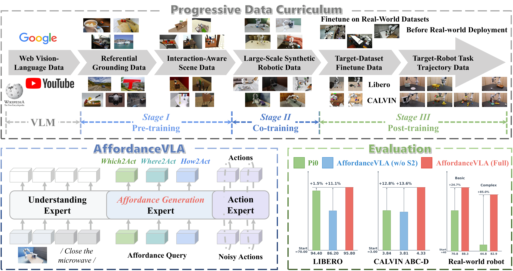
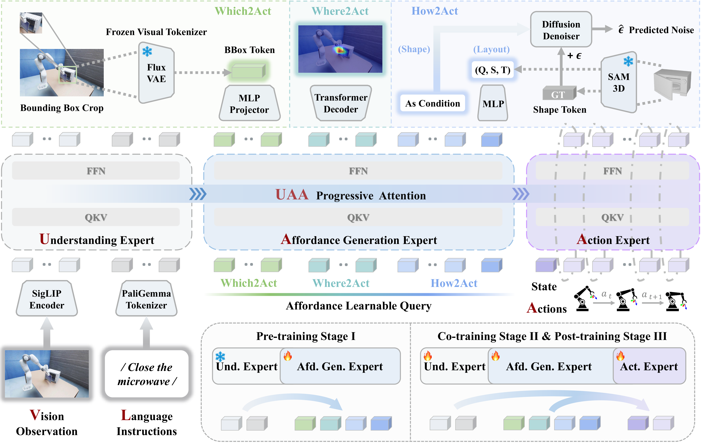

<div align="center">

## AffordanceVLA: Empowering Action Generation through Affordance-Aware Understanding

[](https://skywalker-yqz.github.io/AffordanceVLA/) [](https://arxiv.org/abs/2606.06155) [](LICENSE)

[Qize Yu](https://skywalker-yqz.github.io/)<sup>1,†</sup>, [Jiadi You](https://scholar.google.com/citations?hl=en&user=G5RR8WEAAAAJ)<sup>2,†</sup>, [Yuran Wang](https://wayrise.github.io/)<sup>1</sup>, [Jiaqi Liang](https://github.com/SCreatorX)<sup>1</sup>, [Bowen Ping](https://scholar.google.com/citations?hl=zh-CN&user=DjcKZdkAAAAJ)<sup>1</sup>, [Yang Tian](https://scholar.google.com/citations?user=leXXHKwAAAAJ&hl=zh-CN)<sup>1</sup>, [Yue Chen](https://yuechen0614.github.io/)<sup>1</sup>, [Minghong Cai](https://onevfall.github.io/personal_page/)<sup>3</sup>, [Zeying Gong](https://zeying-gong.github.io/)<sup>2</sup>, [Ruihai Wu](https://warshallrho.github.io/)<sup>1</sup>, [Yinchuan Li](https://yinchuanll.github.io/)<sup>4</sup>, [Junwei Liang](https://junweiliang.me/)<sup>2,\*</sup>, [Yingcong Chen](https://www.yingcong.me/)<sup>2,\*</sup>

<sup>1</sup>Peking University &nbsp;&nbsp; <sup>2</sup>HKUST (Guangzhou) &nbsp;&nbsp; <sup>3</sup>CUHK &nbsp;&nbsp; <sup>4</sup>Knowin AI

<sup>†</sup>Equal contribution &nbsp;&nbsp; <sup>*</sup>Corresponding authors

</div>



AffordanceVLA introduces **structured affordance forecasting** as a task-oriented intermediate representation that bridges vision, language, and action. It models manipulation priors through three complementary components — **Which2Act** (object-centric grounding via visual-latent prediction), **Where2Act** (2D interaction localization via affordance maps), and **How2Act** (3D geometric reasoning) — integrated into a **Mixture-of-Transformer (MoT)** architecture and trained with a three-stage progressive curriculum.

This repository contains the model, training, and the automated affordance-annotation pipeline. For results, qualitative demos, and analysis, please see the [project page](https://skywalker-yqz.github.io/AffordanceVLA/).

> **Key idea.** Affordances serve as a perfect bridge, seamlessly coupling spatial grounding in vision, semantic conditioning in language, and execution guidance in action.

## Method



The framework comprises three specialized experts coordinated by a unidirectional **Understanding–Affordance–Action (UAA) progressive attention**:

- **Understanding Expert** (M<sub>und</sub>, PaliGemma: SigLIP + Gemma) fuses the observation O<sub>t</sub>, instruction *l*, and proprioceptive state s<sub>t</sub> into an instruction-aware multimodal representation h<sub>und</sub>.
- **Affordance Generation Expert** (M<sub>gen</sub>, Gemma + learnable queries) decodes h<sub>und</sub> into structured affordance tokens Â<sub>t</sub> (Which2Act, Where2Act, How2Act).
- **Action Expert** (M<sub>act</sub>, Gemma, flow matching) synthesizes the action chunk â<sub>t:t+k</sub> conditioned on h<sub>und</sub> and Â<sub>t</sub>.

UAA attention is bidirectional within each expert and strictly causal across experts: the Affordance Generation expert attends to the Understanding expert only, and the Action expert attends to both. This keeps action information from leaking into the affordance prediction stage (`src/utils/model_utils.py::make_att_2d_masks`).

### Structured affordance knowledge

| Module | Role | Prediction target | Loss |
|--------|------|-------------------|------|
| **Which2Act** | Object-centric grounding | Continuous visual latent of the target crop (frozen Flux VAE) | MSE (Eq. 1, default; Smooth-L1 optional) |
| **Where2Act** | 2D interaction localization | Pixel-level affordance heatmap | BCE (Eq. 2) |
| **How2Act** | 3D geometric reasoning | 3D shape latent (diffusion) + 10-DoF layout | ε-prediction MSE + Smooth-L1 (Eqs. 3–4) |

```
L_which  = (1 / (C·H·W)) · Σ  || ẑ − z_q ||²                              # Eq. 1
L_where  = − (1 / (H·W)) · Σ  [ M·log σ(ŷ) + (1−M)·log(1−σ(ŷ)) ]          # Eq. 2
L_shape  = E_{t, ε} || ε − ε̂_θ(x_t, t, h_shape) ||²                       # Eq. 3
L_layout = (1/10) · Σ  SmoothL1( ŷ_layout , y_layout )                    # Eq. 4
```

The Which2Act loss is selected by `WHICH2ACT_FLUX_LOSS_TYPE` at the top of `src/models/which2act_decoder.py` (`"mse"` by default; `"smooth_l1"` is also available).

### Three-stage progressive training

| Stage | Data | Trained | Frozen |
|-------|------|---------|--------|
| **I — Affordance** | PRISM, AGD20K, RefSpatial, VQA | Affordance Generation expert, queries, decoders (How2Act trainable; toggle via `STAGE1_TRAIN_HOW2ACT`) | Vision Encoder, Understanding, Action |
| **II — Robotic Co-Training** | InternData-A1 (synthetic robot) | All experts + decoders; Vision Encoder fine-tuned at a lower LR | — |
| **III — Target Post-Training** | LIBERO / CALVIN | Same trainable set as Stage II | — |

`STAGE1_TRAIN_HOW2ACT` and `STAGE2_FREEZE_VISION_ENCODER` (top of `src/train.py`) control these toggles. By default Stage I trains the How2Act decoder, and Stages II/III fine-tune the vision encoder at `training.vision_encoder_lr`.

### Model variants

The token allocation of the Affordance Generation expert is fully driven by the YAML config — no code changes required to switch between the variants below (each row shows the relevant fields under `model:` in the YAML).

| Variant | `which2act_num_tokens` | `where2act_num_tokens` | `how2act_shape_num_tokens` | `how2act_layout_num_tokens` | `how2act_num_tokens` (= shape + layout) | N<sub>gen</sub> | Which2Act encoder |
|---------|------------------------|------------------------|----------------------------|------------------------------|-----------------------------------------|------|----------------|
| Prev               | 64 | 16 |  30 | 2 |  32 | 112 | VQ-VAE  |
| AffordanceVLA-fast | 16 | 16 |  30 | 2 |  32 |  64 | Flux VAE |
| AffordanceVLA      | 64 | 64 | 256 | 4 | 260 | 388 | Flux VAE |

The shipped `configs/stage1.yaml` / `stage2.yaml` / `stage3 *.yaml` use the **AffordanceVLA-fast** layout (16 / 16 / 30+2). Switch variants by editing the four token fields above. An optional wrist token group can be appended at any scale by setting `control_wristtoken: true`; it shares the same decoder architecture and weights as Which2Act and is supervised by the full wrist-camera image.

> **Note.** With the Flux VAE backend, the projection head requires
> `gen_hidden_dim == latent_channels × patch_size²` so that
> `D_proj = 16384 / which2act_num_tokens` matches the generation expert hidden
> size. The fast variant satisfies this with 16 tokens. Other token counts
> require a corresponding change to the projection head in
> `src/models/which2act_decoder.py::Which2ActFluxDecoder`.

`configs/` — training configurations:


## Installation

The full pipeline integrates several heavyweight stacks (the VLA model, two
robot simulators, and multiple vision/grounding services) whose dependencies
are mutually incompatible. We therefore ship one frozen `pip freeze` per role
under [`env/`](env/) rather than a single root-level `requirements.txt`. See
[`env/README.md`](env/README.md) for the full matrix; the main training
environment is:

```bash
conda create -n affordancevla python=3.11 -y
conda activate affordancevla
pip install -r env/requirements_AffordanceVLA.txt
```

For CALVIN / LIBERO evaluation and the auxiliary RexOmni / SAM-3D services,
install the corresponding `env/requirements_*.txt` into a separate conda
environment (Python version per `env/README.md`).

> **Before running `pip install -r`**, two entries in the requirements files
> require manual handling due to environment-deployment conflicts: the SAM3D
> editable install (`-e /mnt/...`) and the `flash-attn` local wheel
> (`file:///mnt/...`). Delete those lines from the respective requirements
> files and install them manually. See [`env/README.md`](env/README.md) for
> the exact steps.

The code is developed and validated with PyTorch (CUDA) on NVIDIA H200 GPUs.

**Compute.** We recommend **at least 8× H200** for training, so that the per-step (effective) batch size in the configs can be reproduced without gradient accumulation. The released results were produced on **8× H200**, **16× H200**, and **16× B200** setups.

## Pretrained weights

AffordanceVLA initializes from public pretrained weights:

| Weight | Download | Config key |
|--------|----------|------------|
| π0 base (MoT backbone init) | [lerobot/pi0_base](https://huggingface.co/lerobot/pi0_base) | `model.pretrained_path` |
| PaliGemma tokenizer | [google/paligemma-3b-pt-224](https://huggingface.co/google/paligemma-3b-pt-224) | `model.language_tokenizer_path` |
| Flux VAE — Which2Act encoder | [John6666/flux1-dev-fp8-flux · `/vae`](https://huggingface.co/John6666/flux1-dev-fp8-flux/tree/main/vae) | `model.which2act_flux_vae_path` |
| VQ-VAE — Which2Act encoder (legacy) | [vae_ch160v4096z32.pth](https://huggingface.co/FoundationVision/var/blob/2fc3ff144f97ddd12207727b60dd6b997bc4cb69/vae_ch160v4096z32.pth) | `model.which2act_vae_ckpt` |

**Which2Act backend switch** (`model.which2act_use_flux_vae`):
- `true`: continuous Flux VAE latent regression. The loss is selected by the `WHICH2ACT_FLUX_LOSS_TYPE` constant at the top of `src/models/which2act_decoder.py` (`"mse"` by default; `"smooth_l1"` available).
- `false` (legacy): discrete VQ-VAE codebook classification with CrossEntropy.

Set `model.which2act_flux_vae_path=null` (Flux mode) or `model.which2act_vae_ckpt=null` (VQ mode) to disable the Which2Act loss.

## Data & affordance-annotation pipeline

Robot datasets (InternData-A1, LIBERO, CALVIN, DROID) do not natively contain dense affordance labels. The `src/datasets/preprocessing/` package implements the automated pipeline that synthesizes them:

1. **Step 0 — RexOmni fine-tuning** on PRISM (offline; served via `src/services/rexomni_service.py`).
2. **Step 1 — Rule-based keyframe detection** (`keyframe_detection.py`): six rules (Start, Pre-Action, Gripper, Stop, Apex, End) over the robot state, all enabled by default.
3. **Step 2a — Instruction decomposition** (`instruction_decomposition.py`, **Prompt A**): a text LLM splits the long-horizon instruction into per-keyframe sub-instructions. The LLM client is loaded by name from a separate module (set `LLM_CLIENT_MODULE` at the top of the file). The prompt templates `SYSTEM_PROMPT` / `USER_PROMPT_TEMPLATE` are intentionally left empty.
4. **Step 2b — Per-keyframe annotation** (`keyframe_affordance_annotation.py`, **Prompt B**): a VLM emits a RexOmni-style detection category + spatial "where-to" affordance query per keyframe. The default backend is RexOmni; Qwen3-VL is available as a side path (`ANNOTATION_BACKEND` toggle). Endpoints / tokens come from environment variables (see `EnvVars` inside the file). Prompt templates are likewise left empty.
5. **Step 3 — Visual grounding & affordance generation** (`RexOmni_SAM_Affordance_pipeline.py`): the grounding model produces a bbox + affordance point, SAM segments the target, and a mask-bounded Gaussian heatmap is generated.
6. **Step 4 — Quality verification**: `pipeline.annotate_frame` returns a `passes_qc` flag based on a point-in-bbox consistency check (`POINT_IN_BBOX_TOLERANCE_PX` at the top of `pipeline.py`).

The end-to-end orchestration lives in `src/datasets/preprocessing/pipeline.py`. SAM-3D shape and layout tokens are extracted optionally by setting `SAM3D_SERVICE_URL` at the top of that file; the same switch can be enabled for Stage I VQA-style sources via `pipeline.annotate_vqa_sample(enable_sam3d=True, ...)`.

> Prompt templates and LLM/VLM clients are not bundled. Fill in the `SYSTEM_PROMPT` / `USER_PROMPT_TEMPLATE` constants in
> `instruction_decomposition.py` and `keyframe_affordance_annotation.py`,
> and provide an LLM client module exposing `call(system_prompt, user_prompt) -> str` (and, for Step 2b, `call_with_image(...)`).

### Dataset loaders

Concrete `Dataset` classes for the four Stage I sources (PRISM, AGD20K, RefSpatial, VQA) and the three robot datasets (InternData-A1, LIBERO, CALVIN) are intentionally not bundled, since each source's on-disk format depends on which release / split / archive you download. The Stage I sources all ship with their own native labels (heatmaps, segmentation maps, bounding boxes, or interaction points) — consume them directly rather than re-running RexOmni. We recommend writing the loaders via vibe coding: feed a few real samples and the schema of your downloaded data to a coding agent, and have it produce a loader that yields the unified `AffordanceSample` dict expected by `src/datasets/collate.py::affordance_collate_fn` and `src/train.py::create_datasets`.

The schema and reusable building blocks are bundled in `src/datasets/base_dataset.py`: the `AffordanceSample` `TypedDict` (the data contract), the `LayoutToken` schema, tensor helpers (`image_to_tensor`, `heatmap_to_tensor`, `resize_sample`), the `build_stage1_sample` / `build_stage2_sample` constructors, and the `BaseAffordanceDataset` base class. Build your loader against these — `AffordanceSample` and the constructors are also re-exported from `src.datasets`.

### Service startup

Bring up the auxiliary services first (each runs in its own conda environment):

```bash
# RexOmni + SAM (detection / pointing / SAM segmentation / full pipeline)
# Update REXOMNI_MODEL_PATH at the top of the file to use a fine-tuned checkpoint.
conda activate rexomni
python -m src.services.rexomni_service \
    --port 7862 \
    --preload \
    --model_path /path/to/rexomni-finetuned \
    --sam_checkpoint /path/to/sam_vit_h.pth

# SAM-3D (shape latent + layout tokens)
conda activate SAM3D
python -m src.services.sam3d_service \
    --port 17861 \
    --mode latent \
    --preload
```

For the VLM endpoints used by Step 2 (when `VLM_CLIENT_MODULE` is not set), supply the corresponding URL / token through environment variables:

```bash
# Step 2a — text LLM
export LLM_API_URL=...
export LLM_API_TOKEN=...

# Step 2b — VLM (variables consulted depend on ANNOTATION_BACKEND)
export REXOMNI_VLM_URL=...    REXOMNI_VLM_TOKEN=...     # RexOmni backend
export QWEN3_VL_API_URL=...   QWEN3_VL_API_TOKEN=...    # Qwen3-VL backend
```

## Training

All training is YAML-driven. Use `torchrun` for multi-GPU and CLI dotlist overrides for any field. `--mode train` uses the full data; `--mode debug` (default) uses a minimal subset for smoke tests.

The shipped training configs under `configs/`:

```
configs/
├── stage1.yaml                         # Stage I  (VQA / affordance grounding)
├── stage2.yaml                         # Stage II (robot co-training, InternData-A1)
├── stage3 CALVIN.yaml                  # Stage III (CALVIN fine-tune)
├── stage3 Libero.yaml                  # Stage III (LIBERO fine-tune)
└── debug_flux_vae.yaml                 # Smoke test for the Flux VAE pipeline
```

The dataset-specific loaders (PRISM / AGD20K / RefSpatial / VQA / A1 / LIBERO / CALVIN) are not bundled — as described under [Dataset loaders](#dataset-loaders), write your own (vibe coding recommended) so each yields the unified `AffordanceSample` defined in `src/datasets/base_dataset.py`. The VQA source is a data pool of ~18,000,000 entries (Rex-Omni's open-source subset + Knowin AI in-house data; see `data/VQA/README.md`). Only a sampled portion is used for training, and different model variants draw different sampling magnitudes. The specific subset will be partially open-sourced after a license-legality review of the collected data.

```bash
# Stage I — affordance grounding pre-training
torchrun --nproc_per_node=8 -m src.train --config configs/stage1.yaml --mode train \
    model.pretrained_path=$PRETRAINED_ROOT/pi0_base \
    model.language_tokenizer_path=$PRETRAINED_ROOT/paligemma-3b-pt-224 \
    model.which2act_flux_vae_path=$PRETRAINED_ROOT/flux-vae

# Stage II — robotic co-training (init from Stage I)
torchrun --nproc_per_node=8 -m src.train --config configs/stage2.yaml --mode train \
    model.pretrained_path=$PRETRAINED_ROOT/pi0_base \
    model.load_ckpt=outputs/stage1/checkpoint-XXXXX \
    model.language_tokenizer_path=$PRETRAINED_ROOT/paligemma-3b-pt-224 \
    model.which2act_flux_vae_path=$PRETRAINED_ROOT/flux-vae

# Stage III — target-task fine-tuning (init from Stage II)
torchrun --nproc_per_node=8 -m src.train --config "configs/stage3 CALVIN.yaml" --mode train \
    model.load_ckpt=outputs/stage2/checkpoint-XXXXX ...
torchrun --nproc_per_node=8 -m src.train --config "configs/stage3 Libero.yaml" --mode train \
    model.load_ckpt=outputs/stage2/checkpoint-XXXXX ...
```

### Loss weighting

The Affordance loss decomposes into four terms whose internal ratio is fixed at
`which : where : shape : layout = 5 : 5 : 5 : 2`. The action flow-matching loss
weight stays at `1.0`. The two stages differ only in the *aggregate* affordance
weight relative to the action loss:

| Stage | Aggregate Afd : Act | `which2act_loss_weight` | `where2act_loss_weight` | `how2act_shape_loss_weight` | `how2act_layout_loss_weight` |
|-------|---------------------|-------------------------|-------------------------|-----------------------------|------------------------------|
| Stage II  | 0.50 : 1 | 0.147  | 0.147  | 0.147  | 0.0588 |
| Stage III | 0.15 : 1 | 0.0441 | 0.0441 | 0.0441 | 0.0176 |

In Stage I the action loss is inactive (no ground-truth actions); Stage I keeps the original 0.1 / 0.1 / 0.1 / 0.04 weights, which preserves the 5 : 5 : 5 : 2 internal ratio.

### Configuration notes

- `model.chunk_size` must equal `data.chunk_size` (the action attention mask is built from `model.chunk_size`).
- `control_wristtoken` is optional: when set, an extra wrist token group (sharing the Which2Act decoder) is appended; the wrist token is inactive in Stage I (no wrist data) and supervised by the full wrist image in Stage II/III.
- The Vision Encoder is fine-tuned at `training.vision_encoder_lr` in Stage II/III. To freeze it instead, set `STAGE2_FREEZE_VISION_ENCODER = True` at the top of `src/train.py`.
- Per-step delta-action limits (`pos_limit`, `ori_limit`) are not hard-coded; supply them in the YAML, calibrated from the source datasets at the chosen `frame_num`.

```bash
# Auto-resume from the latest checkpoint in output_dir (default behavior)
python -m src.train --config configs/stage1.yaml

# Graceful stop: training saves a checkpoint and exits after the current step
touch outputs/stage1/STOP
```

## LIBERO evaluation notes

The original LIBERO HDF5 demonstrations store agent-view RGB frames upside-down (OpenGL convention), and require a **vertical flip** (`[::-1]`) — not a 180-degree rotation — when consumed by training and evaluation. We recommend following the LIBERO benchmark setup released by [openvla/openvla](https://github.com/openvla/openvla), whose evaluation pipeline ships at 256×256 (vs. the original 128×128) and improves the upper bound of perception-driven policies.

Empirical notes that may save debugging time when porting a LIBERO checkpoint to a new evaluation harness:

- Make sure the gripper command sent to the OSC controller has the same sign convention as the demonstrations (`+1 = close, -1 = open` with `np.sign`-based gating). Predicting a continuous openness value and forwarding it directly may flip the gripper direction during the early grasp phase.
- When `CONTROL_SPEED=True`, the model outputs *normalized* delta actions in `[-1, 1]`; convert them back to OSC space using the same `pos_limit` / `ori_limit` that were used during data preparation, otherwise rotation magnitudes are systematically attenuated.
- Position OSC commands are clipped to `[-1, 1]`; large per-step displacements may be silently truncated. Keep this in mind when comparing per-step physical motion against the model's intent.

## Known issues & notes

**Video-decoding memory growth (PyAV/FFmpeg).** When training on video-based data (e.g., InternData-A1), repeated PyAV/FFmpeg decoding makes host RSS grow monotonically across steps, eventually raising `Cannot allocate memory` and triggering cascading DDP/NCCL failures. The root cause is *not* a missing Python `del`: decoding spans low-level C/C++ decoders, mmap, buffer pools, and malloc arenas, replicated across DataLoader workers and DDP ranks — state that Python-side `del` / `gc.collect()` cannot fully reclaim. The practical fix bounds the growth rather than fully fixing FFmpeg's release path:

- Explicitly close decoder/container objects, delete temporary frame arrays, and call `gc.collect()` periodically.
- Clear Dataset/trajectory caches and reclaim memory at training-loop boundaries.
- Most importantly, set `persistent_workers=False` and lower `prefetch_factor` so DataLoader workers restart periodically, truncating low-level decoder accumulation at the process level.

This turns unbounded memory growth into a bounded, recoverable state. See [this analysis](https://blog.csdn.net/qq_52184520/article/details/156071663) for details.

**InternData-A1 — re-download if needed.** If you downloaded InternData-A1 *before 2026/01/15*, please re-download from [InternRobotics/InternData-A1](https://huggingface.co/datasets/InternRobotics/InternData-A1/tree/main): our co-author fixed minor issues in the Franka basic-task subset and added camera intrinsics/extrinsics plus a LeRobot 3.0 export.

## Explore more awesome affordance

- [A3D](https://skywalker-yqz.github.io/A3D/) — Dual-Arm Assembly (AAAI 2026 Oral)
- [PA3FF](https://pa3ff.github.io/) — Part-Aware 3D Feature Field (ICLR 2026)
- [DexGarmentLab](https://wayrise.github.io/DexGarmentLab/) — Dexterous Garment Manipulation (NeurIPS 2025 Spotlight)
- [DualAfford](https://hyperplane-lab.github.io/DualAfford/) — Collaborative Dual-Gripper Affordance (ICLR 2023)

## TODO

- [x] Paper
- [x] Project page
- [x] Model & training code (main structure)
- [x] Affordance-annotation / data-preprocessing pipeline code
- [ ] **Data release** — partial open-source of the collected subsets, pending a license-legality review of the data pool.
- [ ] **Model weights** — pending confirmation of the weight license definition.

## Citation

If you find AffordanceVLA useful, please consider citing our [paper](https://arxiv.org/abs/2606.06155):

```bibtex
@misc{yu2026affordancevlavisionlanguageactionmodelempowering,
      title={AffordanceVLA: A Vision-Language-Action Model Empowering Action Generation through Affordance-Aware Understanding}, 
      author={Qize Yu and Jiadi You and Yuran Wang and Jiaqi Liang and Bowen Ping and Yang Tian and Yue Chen and Minghong Cai and Zeying Gong and Ruihai Wu and Yinchuan Li and Junwei Liang and Yingcong Chen},
      year={2026},
      eprint={2606.06155},
      archivePrefix={arXiv},
      primaryClass={cs.RO},
      url={https://arxiv.org/abs/2606.06155}, 
}
```

## Acknowledgements

The MoT backbone and flow-matching action expert build on the open-source VLA
ecosystem (π<sub>0</sub> / PaliGemma); the data pipeline integrates
[RexOmni](https://github.com/IDEA-Research/Rex-Omni), [Qwen3-VL](https://github.com/QwenLM/Qwen3-VL),
[SAM](https://github.com/facebookresearch/segment-anything), and SAM-3D.
The LIBERO evaluation setup follows [openvla/openvla](https://github.com/openvla/openvla).

## License

Released under the [MIT License](LICENSE).
